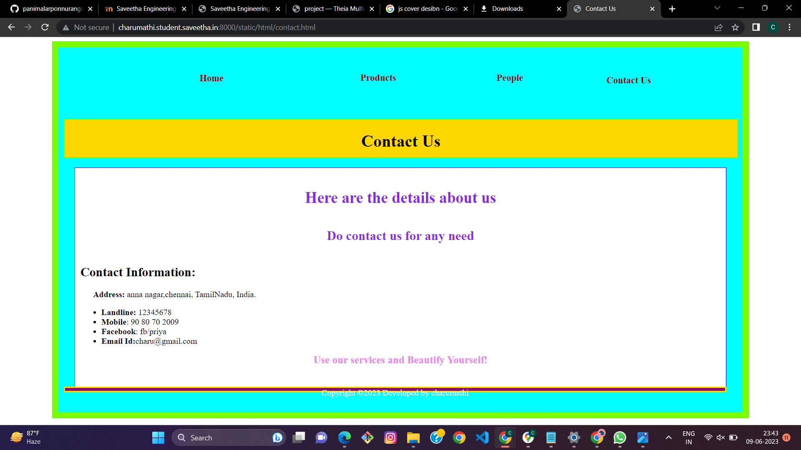
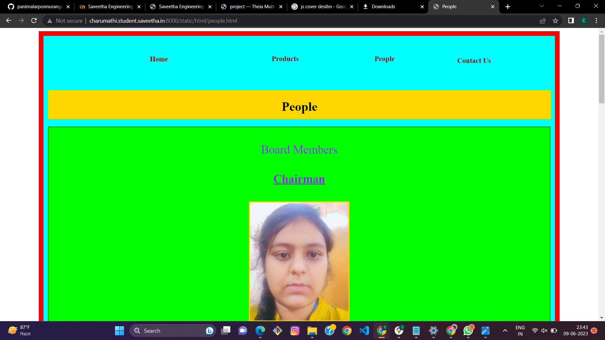
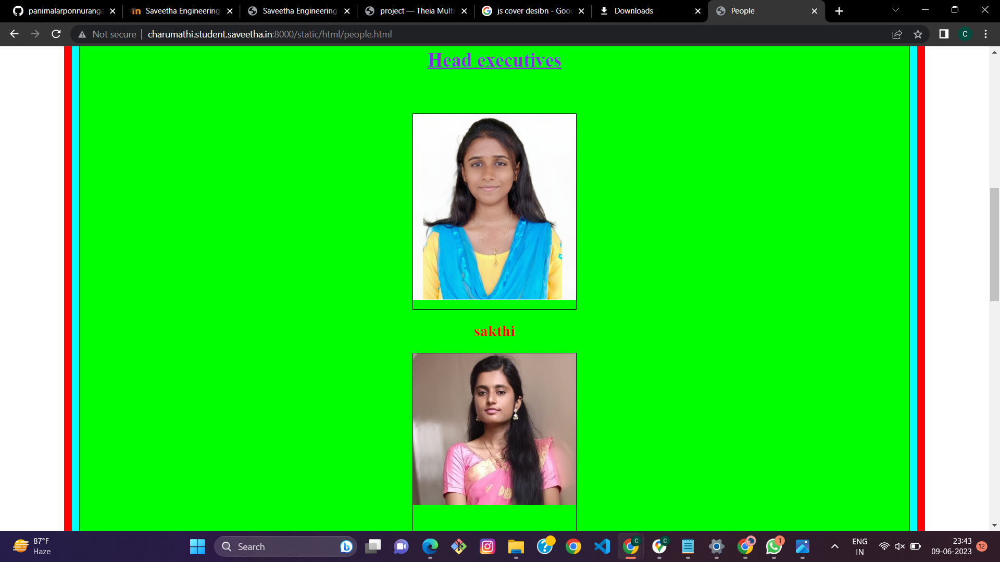
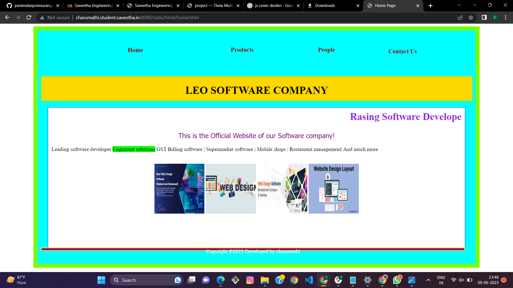
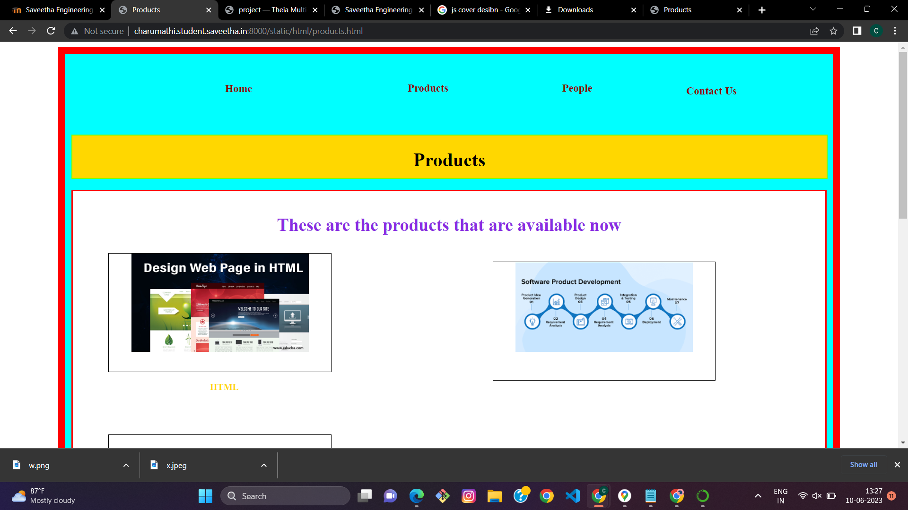
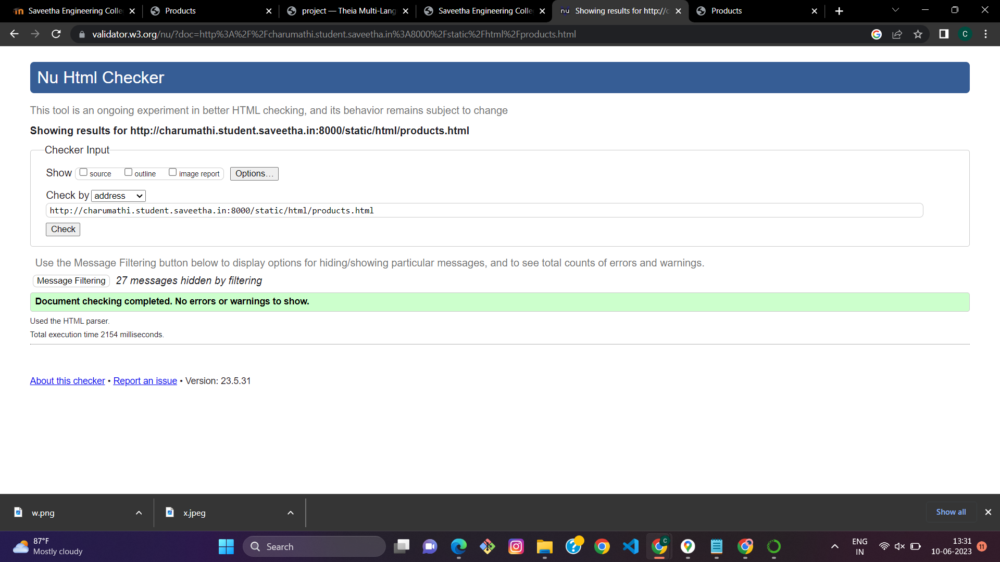

# Ex.07 Software Product Company Website
## AIM:
To develop a static company website to display the softwares and services provided by the company.

## DESIGN STEPS:

### Step 1:
Requirement collection.

### Step 2:
Creating the layout using HTML and CSS.

### Step 3:
Updating the sample content.

### Step 4:
Choose the appropriate style and color scheme.

### Step 5:
Validate the layout in various browsers.

### Step 6:
Validate the HTML code.

### Step 7:
Publish the website in the given URL.

## PROGRAM:
```
styles.css
.home{
            height: 700px;
            width: 85%;
            border: 12px solid lawngreen;
            padding-left:10px;
            padding-right:10px;
            margin-left: auto;
            margin-right:auto;
            background-color:cyan;
        }
        .content{
            border:1px solid blue;
            background-color: white;
            width:95%;
            height:400px;
            padding:10px;
            margin-left:auto;
            margin-right:auto;
        }
        .header{
            height: 128px;
            width:100%;
            background-image: url(/static/images/header.png);
            background-size: cover;
            
        }
        .logo{
            height:21%;
            width: 10%;
            position:absolute;
            background-image: url(/static/images/icon.png);
            background-size:cover;
            
        }
        .prod{
            height:auto;
            width:auto;
            position:relative;
            bottom:10px;
            left:550px;
            border:4px solid transparent;
            text-align:center;
            display: inline;
            padding:15px;
            font-family:'Algerian';
            font-size: large;  
        }
        .prod:hover{
            background-color:darkmagenta;
        }
        .people{
            height:auto;
            width:auto;
            position:relative;
            bottom:10px;
            left:700px;
            border:4px solid transparent;
            text-align:center;
            display: inline;
            padding:15px;
            font-family:'Algerian';
            font-size: large;  
        }
        .people:hover{
            background-color:darkmagenta;
        }
        .contact{
            height:20px;
            width:10%;
            position:relative;
            bottom:45px;
            left:1000px;
            border:4px solid transparent;
            text-align:center;
            padding:15px;
            font-family:'Algerian';
            font-size: large;  
        }
        .contact:hover{
            background-color:darkmagenta;
        }
                
        .h{
            height:20px;
            width:10%;
            position:relative;
            top:30px;
            left:200px;
            border:4px solid transparent;
            text-align:center;
            
            padding:15px;
            font-family:'Algerian';
            font-size: large;  
        }
        .h:hover{
            background-color:darkmagenta;
            overflow:hidden;
        }
        .footer{
            border:3px solid gold;
            width:98%;
            height:6px;
            position:relative;
            bottom: 1px;
            background-color: darkmagenta;
            text-align:center;

        }
        .title{
            border:2px solid lawngreen;
            background-color:gold;
            padding:1px;
            width:99.7%;
            height: 70px;
            text-align:center;
            font-family:'Alberian';
            margin-left:auto;
            margin-right: auto;
            
        }
        .content1{
            border:1px solid blue;
            background-color: white;
            width:98%;
            height:100px;
            padding:10px;
            margin-left:auto;
            margin-right:auto;

        }
people.html
<!DOCTYPE html>
<html lang="en">
    <head>
        <title>
            People
        </title>
        <meta name="viewport" content="width=device-width, initial-scale=1.0">
        <link rel="stylesheet" href="/static/CSS/styles.css">
        <style>
        .home{
            height: 3000px;
            width: 85%;
            border: 12px solid red;
            padding-left:10px;
            padding-right:10px;
            margin-left: auto;
            margin-right:auto;
            background-color:cyan;
        }
        .text{
        color:blueviolet;
        font-family:'Lucida Sans';
        font-size: 30px;
        text-align:center;
        
        }
        .content{
            border:2px solid green;
            background-color:lime;
            width:98%;
            height:2690px;
            padding:10px;
            margin-left:auto;
            margin-right:auto;
        }
        .ceoph{
            background-image: url(/static/images/charu1.jpg);
            background-size: 250px;
            background-position-x: center;
            background-repeat: no-repeat;
            border:3px solid gold;
            height:300px;
            width:20%;
            position:relative;
            left: 0px;
            margin-left:auto;
            margin-right: auto;
        }
        .ceo{
            color: red;
            position:relative;
            text-align:center;
            
            
        }
        .manph1{
            background-image: url(/static/images/copy1.jpg);
            background-size: 250px;
            background-position-x: center;
            background-repeat: no-repeat;
            border:1px solid black;
            height:300px;
            width:20%;
            position:relative;
            margin-left:auto;
            margin-right:auto;            
        }
        .man1{
            color: red;
            position:relative;
            text-align:center;
            
        }
        .manph2{
            background-image: url(/static/images/copy2.jpg);
            background-size: 250px;
            background-position-x: center;
            background-repeat: no-repeat;
            border:1px solid black;
            height:300px;
            width:20%;
            position:relative;
            margin-left:auto;
            margin-right:auto;

            
        }
        .man2{
            color: red;
            position:relative;
            text-align:center;
        }
        
        .amph1{
            background-image: url(/static/images/copy3.jpg);
            background-size: 250px;
            background-position-x: center;
            background-repeat: no-repeat;
            border:1px solid black;
            height:300px;
            width:20%;
            position:relative;
            margin-left:auto;
            margin-right:auto;

            
        }
        .am1{
            color: red;
            position:relative;
            text-align:center;
        }

        .amph2{
            background-image: url(/static/images/copy4.jpg);
            background-size: 250px;
            background-position-x: center;
            background-repeat: no-repeat;
            border:1px solid black;
            height:220px;
            width:20%;
            position:relative;
            margin-left:auto;
            margin-right:auto;

            
        }
        .am2{
            color: red;
            position:relative;
            text-align:center;
        }
        

        </style>
    </head>
    <body>
        <div class="home">
            <div class="header">
                <header>
                    <div class=logo></div>
                    <div class=h>
                    <a href="home.html" title="Home" style="color: darkred; text-decoration: none;"><b>Home</b></a></div>
                    <div class="prod">
                        <a href="products.html" title="Products" style="color: darkred; text-decoration: none;"><b>Products</b></a>
                    </div>
                    <div class="people">
                        <a href="people.html" title="People" style="color:darkred; text-decoration: none;"><b>People</b></a>
                    </div>
                    <div class="contact">
                        <a href="contact.html" title="Contact Us" style="color:darkred; text-decoration: none;"><b>Contact Us</b></a>
                    </div>
                </header>
                <div class="title">
                    <h1>People</h1>
                </div><br>
                <div class="content">
                    <div class="text">
                    <p>Board Members</p>
                    <h4><u>Chairman</u></h4>
                    </div>
                    <div class="ceoph"></div>
                    <div class="ceo"><p align="center"><b><h2>charumathi</h2></b></div>
                    <br>
                    <div class="text">
                        <p><b><u>Head executives</u></b></p><br>
                    </div>
                    <div class="manph1"></div>
                    <div class="man1"><p align="center"><b><h2>sakthi</h2></b></p></div>
                    <div class="manph2"></div>
                    <div class="man2"><p><b><h2>keerthana</h2></b></p></div>
                    <br>
                    <div class="text"><p><b><u>panimalar</u></b></p></div><br>
                    <div class="amph1"></div>
                    <div class="am1"><p align="center"><b><h2>kowiska</h2></b></p></div>
                    

                    
                    <div class="am3"><p align="center"><b><h2></h2></b></p></div><br>
                    <div class="text">Quality code for reliable future!<br>!</div>
                </div>
                <div class="footer">
                <footer style="color:white">
                Copyright &copy;2023 Developed by charumathi</footer></div>
            </div>
        </div>
    </body>
</html>
contact.html
<!DOCTYPE html>
<html lang="en">
    <head>
        <title>
            Contact Us
        </title>
        <meta name="viewport" 
         content="width=device-width, initial-scale=1.0">
        <link rel="stylesheet" href="/static/CSS/styles.css">
    <style>
    .text{
        color:blueviolet;
        font-family:'Lucida Sans';
        font-size: 30px;
        text-align:center;
    }
    
    </style>

    </head>
    <body>
        <div class="home">
            <div class="header">
                <header>
                    <div class=logo></div>
                    <div class=h>
                    <a href="home.html" title="Home" style="color: darkred; text-decoration: none;"><b>Home</b></a></div>
                    <div class="prod">
                        <a href="products.html" title="Products" style="color: darkred; text-decoration: none;"><b>Products</b></a>
                    </div>
                    <div class="people">
                        <a href="people.html" title="People" style="color:darkred; text-decoration: none;"><b>People</b></a>
                    </div>
                    <div class="contact">
                        <a href="contact.html" title="Contact Us" style="color:darkred; text-decoration: none;"><b>Contact Us</b></a>
                    </div>
                </header>
                <div class="title">
                    <h1>Contact Us</h1>
                </div><br>
                <div class="content">
                    <div class="text">
                    <p><b>Here are the details about us
                    <h5>Do contact us for any need</h5></b></p>
                    
                    </div>
                    <b><h2>Contact Information:</h2></b>
                    <p><b>&emsp;&ensp;Address:</b>
                        anna nagar,chennai, TamilNadu, India.
                    </p>
                    <ul>
                        <li><b>Landline:</b> 12345678</li>
                        <li><b>Mobile</b>: 90 80 70 2009</li>
                        <li><b>Facebook</b>: fb/priya</li>
                        <li><b>Email Id:</b>charu@gmail.com</li>
                    </ul>
                    <div style="text-align: center;color:violet;font-size:20px;"><b>Use our services and Beautify Yourself!</b></div>

                </div>
                <div class="footer">
                <footer style="color:white">
                Copyright &copy;2023 Developed by charumathi</footer></div>
            </div>
        </div>
    </body>
</html>
home.html
<!DOCTYPE html>
<html lang="en">
    <head>
        <title>
            Home Page
        </title>
        <meta name="viewport" 
         content="width=device-width, initial-scale=1.0">
        <link rel="stylesheet" href="/static/CSS/styles.css">
    <style>
    .text{
        color:blueviolet;
        font-family:'Lucida Sans';
        font-size: 30px;
        text-align:center;
    }
    img{
        height: 150px;
        width: 150px;
        align-items:center;
    }
    </style>

    </head>
    <body>
        <div class="home">
            <div class="header">
                <header>
                    <div class=logo></div>
                    <div class=h>
                    <a href="home.html" title="Home" style="color: darkred; text-decoration: none;"><b>Home</b></a></div>
                    <div class="prod">
                        <a href="products.html" title="Products" style="color: darkred; text-decoration: none;"><b>Products</b></a>
                    </div>
                    <div class="people">
                        <a href="people.html" title="People" style="color:darkred; text-decoration: none;"><b>People</b></a>
                    </div>
                    <div class="contact">
                        <a href="contact.html" title="Contact Us" style="color:darkred; text-decoration: none;"><b>Contact Us</b></a>
                    </div>
                </header>
                <div class="title">
                    <h1>LEO SOFTWARE COMPANY</h1>
                </div><br>
                <div class="content">
                    <div class="text">
                    <marquee><b>Rasing Software Developer</b></marquee>
                    <p style="color:purple; font-family:'Tahoma'; font-size:20px;"> This is the Official Website of our Software company!</p>
                    </div>
                    <p>Leading software developer <span style="background-color:lime">Cognizant solutions</span>
                         GST Billing software | Supermarket software | Mobile shops | Restaurent management| And much more</p>
                    <br>
                <center>
                    
                    
                    
                    
                    
                    
                </center>
                </div>
                <div class="footer">
                <footer style="color:white">
                Copyright &copy;2023 Developed by charumathi</footer></div>
            </div>
        </div>
    </body>
</html>
products.html
<!DOCTYPE html>
<html lang="en">
    <head>
        <title>
            Products
        </title>
        <meta name="viewport" content="width=device-width, initial-scale=1.0">
        <link rel="stylesheet" href="/static/CSS/styles.css">
        <style>
        .home{
            height: 1555px;
            width: 85%;
            border: 12px solid red;
            padding-left:10px;
            padding-right:10px;
            margin-left: auto;
            margin-right:auto;
            background-color:cyan;
        }
        .text{
            color:blueviolet;
            font-family:'Lucida Sans';
            font-size: 30px;
            text-align:center;
        
        }
        .content{
            border:3px solid red;
            background-color: white;
            width:98%;
            height:1190px;
            padding:10px;
            margin-left:auto;
            margin-right:auto;
        }
        .ph1{
            background-image: url(/static/images/h.jpg);
            background-size: 300px;
            background-position-x: center;
            background-repeat: no-repeat;
            border:1px solid black;
            height:200px;
            width:30%;
            position:relative;
            left: 50px;
        }
        .l1{
            color: gold;
            position:relative;
            right:380px;
            
            
        }
        .ph2{
            background-image: url(/static/images/Z.jpeg);
            background-size: 300px;
            background-position-x: center;
            background-repeat: no-repeat;
            border:1px solid black;
            height:200px;
            width:30%;
            position:relative;
            left: 50px;
            
        }
        .l2{
            color: sandybrown;
            position:relative;
            right:380px;

        
        }
        .ph3{
            background-image: url(/static/images/w.png);
            background-size: 300px;
            background-position-x: center;
            background-repeat: no-repeat;
            border:1px solid black;
            height:200px;
            width:30%;
            position:relative;
            left: 700px;
            bottom: 600px;
        }
        .l3{
            color: gold;
            position:relative;
            right:380px;
            
            
        }
        .ph4{
            background-image: url(/static/images/x.jpeg);
            background-size: 300px;
            background-position-x: center;
            background-repeat: no-repeat;
            border:1px solid black;
            height:200px;
            width:30%;
            position:relative;
            left: 50px;
        }
        .l4{
            color: gold;
            position:relative;
            right:380px;
            
            
        }
        .bot{
            text-align:center;
            font-size:larger;
            color:magenta;

        }
        </style>
    </head>
    <body>
        <div class="home">
            <div class="header">
                <header>
                    <div class=logo></div>
                    <div class=h>
                    <a href="home.html" title="Home" style="color: darkred; text-decoration: none;"><b>Home</a></div>
                    <div class="prod">
                        <a href="products.html" title="Products" style="color: darkred; text-decoration: none;"><b>Products</b></a>
                    </div>
                    <div class="people">
                        <a href="people.html" title="People" style="color:darkred; text-decoration: none;"><b>People</b></a>
                    </div>
                    <div class="contact">
                        <a href="contact.html" title="Contact Us" style="color:darkred; text-decoration: none;"><b>Contact Us</b></a>
                    </div>
                </header>
                <div class="title">
                    <h1>Products</h1>
                </div><br>
                <div class="content">
                    <div class="text">
                    <p>These are the products that are available now</p>
                    </div>
                    <div class="ph1"></div>
                    <div class="l1"><p align="center"><b>HTML<br><br><br><br></p></div>
                    <div class="ph2"></div>
                    <div class="l2"><p align="center"><b>CSS<br><br><br><br></p></div>
                    <div class="ph3"></div>
                    <div class="l3"><p align="center"><b>web software<br><br><br><br></p></div>
                    <div class="ph4"></div>
                    <div class="l4"><p align="center"><b>product development<br><br><br><br></p></div>
         
                </div>
                <div class="bot"><p>To Order Online: Call 90 80 70 2009</p></div>

                <div class="footer">
                <footer style="color:white">
                Copyright &copy;2023 Developed by charumathi</footer></div>
            </div>
        </div>
    </body>
</html>
```

## OUTPUT:






## HTML VALIDATOR:


## RESULT:
The program for designing software company website using HTML and CSS is completed successfully.
